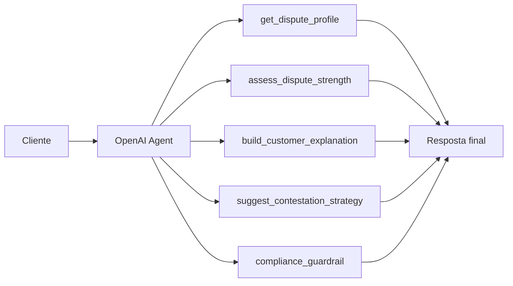

# Agente Contestacao Credito

Um MVP de contestação de crédito baseado no `OpenAI Agents SDK`, desenhado para interagir com clientes, explicar eventos contestados, estimar a força do caso e orientar a próxima ação operacional com linguagem segura.

## Visão Geral

O agente responde perguntas como:

- minha contestação parece forte?
- o que devo destacar no pedido?
- quais documentos sustentam melhor o caso?
- a resposta anterior foi superficial?

## Arquitetura



## Como o OpenAI Agents SDK entra na solução

O projeto foi desenhado com dois modos:

1. `openai_agents_sdk`
   - ativado quando o pacote `openai-agents` está instalado e existe `OPENAI_API_KEY`
2. `deterministic_fallback`
   - usado para manter o MVP executável localmente sem depender de runtime externo

Essa estratégia permite demonstrar a arquitetura de agente mesmo em ambiente sem credencial.

## Estrutura do Projeto

- [src/agent.py](/Users/flaviagaia/Documents/CV_FLAVIA_CODEX/agente_contestacao_credito/src/agent.py)
  - criação do agente e fallback.
- [src/tools.py](/Users/flaviagaia/Documents/CV_FLAVIA_CODEX/agente_contestacao_credito/src/tools.py)
  - funções de domínio usadas pelo agente.
- [src/sample_data.py](/Users/flaviagaia/Documents/CV_FLAVIA_CODEX/agente_contestacao_credito/src/sample_data.py)
  - base demo de casos contestados.
- [app.py](/Users/flaviagaia/Documents/CV_FLAVIA_CODEX/agente_contestacao_credito/app.py)
  - interface em Streamlit.
- [tests/test_agent.py](/Users/flaviagaia/Documents/CV_FLAVIA_CODEX/agente_contestacao_credito/tests/test_agent.py)
  - testes da camada principal.

## Ferramentas do Agente

- `get_dispute_profile`
  - busca o caso estruturado.
- `assess_dispute_strength`
  - estima a força da contestação.
- `build_customer_explanation`
  - traduz o caso em linguagem acessível.
- `suggest_contestation_strategy`
  - recomenda a próxima ação operacional.
- `compliance_guardrail`
  - evita promessas indevidas e reforça linguagem segura.

## Execução Local

### Pipeline

```bash
python3 main.py
```

### Testes

```bash
python3 -m unittest discover -s tests -v
```

### Streamlit

```bash
streamlit run app.py
```

## Resultado Atual da Demo

No caso `DISP-1002`:

- `runtime_mode`: `deterministic_fallback`
- evento contestado: `negative_record`
- impacto no score: `52` pontos
- caso com boa sustentação documental
- estratégia sugerida focada em baixa imediata do registro e reforço do impacto indevido

## Próximas Evoluções

- histórico de iterações do caso;
- memória de atendimento;
- templates regulatórios por tipo de evento;
- integração com base documental real;
- uso de tracing do SDK para observabilidade do agente.

---

# English Version

`Agente Contestacao Credito` is an `OpenAI Agents SDK` MVP for customer-facing credit dispute handling.

The project demonstrates:

- agent-based orchestration for dispute explanation;
- domain-specific dispute tools;
- fallback runtime for local reproducibility;
- Streamlit inspection interface;
- safe-answering orientation for regulated contexts.
