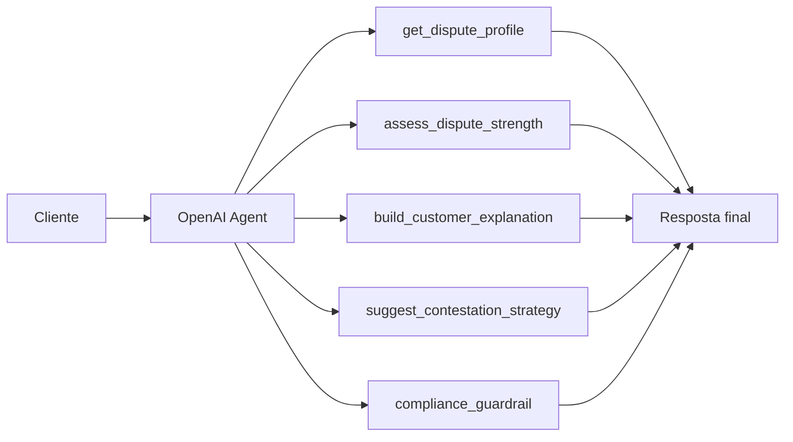

# Agente Contestacao Credito

Um MVP de contestação de crédito baseado no `OpenAI Agents SDK`, desenhado para interagir com clientes, explicar eventos contestados, estimar a força do caso e orientar a próxima ação operacional com linguagem segura.

## Visão Geral

O agente responde perguntas como:

- minha contestação parece forte?
- o que devo destacar no pedido?
- quais documentos sustentam melhor o caso?
- a resposta anterior foi superficial?

## Arquitetura



## Topologia de Execução

O fluxo foi modelado como um `customer-facing dispute agent` com separação explícita entre:

1. `interaction layer`
   - recebe `case_id` e pergunta do cliente
2. `agent orchestration layer`
   - decide quando consultar funções de domínio
3. `dispute tools layer`
   - encapsula recuperação, avaliação, explicação, estratégia e guardrails
4. `presentation layer`
   - expõe o resultado via CLI e Streamlit

Do ponto de vista funcional, a resposta do agente é montada em duas etapas:

- primeiro o caso é consultado e avaliado pelas funções de domínio;
- depois a resposta final é consolidada com linguagem mais acessível e orientação segura.

## Como o OpenAI Agents SDK entra na solução

O projeto foi desenhado com dois modos:

1. `openai_agents_sdk`
   - ativado quando o pacote `openai-agents` está instalado e existe `OPENAI_API_KEY`
2. `deterministic_fallback`
   - usado para manter o MVP executável localmente sem depender de runtime externo

Essa estratégia permite demonstrar a arquitetura de agente mesmo em ambiente sem credencial.

### Decisões de design

- `Agent`
  - representa o orquestrador conversacional principal
- `Runner.run(...)`
  - executa o loop do agente quando o SDK está disponível
- `function_tool`
  - converte funções de domínio em ferramentas chamáveis
- fallback determinístico
  - mantém o projeto executável e testável sem depender de SDK instalado + credencial

Esse desenho deixa a interface consumidora estável, independentemente do runtime efetivo.

### Contrato de retorno

O método `ask_dispute_agent()` retorna sempre:

```json
{
  "runtime_mode": "openai_agents_sdk | deterministic_fallback",
  "answer": "texto final entregue ao cliente"
}
```

Isso simplifica a integração com front-end, logging e avaliação posterior.

## Estrutura do Projeto

- [src/agent.py](/Users/flaviagaia/Documents/CV_FLAVIA_CODEX/agente_contestacao_credito/src/agent.py)
  - criação do agente e fallback.
- [src/tools.py](/Users/flaviagaia/Documents/CV_FLAVIA_CODEX/agente_contestacao_credito/src/tools.py)
  - funções de domínio usadas pelo agente.
- [src/sample_data.py](/Users/flaviagaia/Documents/CV_FLAVIA_CODEX/agente_contestacao_credito/src/sample_data.py)
  - base demo de casos contestados.
- [app.py](/Users/flaviagaia/Documents/CV_FLAVIA_CODEX/agente_contestacao_credito/app.py)
  - interface em Streamlit.
- [tests/test_agent.py](/Users/flaviagaia/Documents/CV_FLAVIA_CODEX/agente_contestacao_credito/tests/test_agent.py)
  - testes da camada principal.

## Ferramentas do Agente

- `get_dispute_profile`
  - busca o caso estruturado.
- `assess_dispute_strength`
  - estima a força da contestação.
- `build_customer_explanation`
  - traduz o caso em linguagem acessível.
- `suggest_contestation_strategy`
  - recomenda a próxima ação operacional.
- `compliance_guardrail`
  - evita promessas indevidas e reforça linguagem segura.

### Semântica de cada tool

#### `get_dispute_profile`
- recupera o caso estruturado;
- serializa o conteúdo em `JSON`;
- garante grounding factual da resposta.

#### `assess_dispute_strength`
- aplica heurística baseada em:
  - quantidade de documentos de suporte;
  - impacto estimado no score;
  - qualidade do histórico de resposta anterior;
- converte esses sinais em força `alta`, `moderada` ou `baixa`.

#### `build_customer_explanation`
- traduz o caso para linguagem compreensível ao cliente;
- preserva fatos principais sem juridiquês excessivo;
- explicita impacto estimado no score.

#### `suggest_contestation_strategy`
- transforma o tipo do evento contestado em próxima ação operacional;
- diferencia estratégias para:
  - `negative_record`
  - `late_payment`
  - `hard_inquiry`

#### `compliance_guardrail`
- reduz risco de promessa indevida;
- reforça que a resposta é orientação inicial;
- evita tratar o output como decisão definitiva.

## Modelo de Dados

Cada caso demo contém:

- `case_id`
- `customer_name`
- `credit_event_type`
- `disputed_reason`
- `amount_brl`
- `days_past_due`
- `score_impact_points`
- `supporting_documents`
- `status`
- `issuer_response_history`

### Exemplo de caso

```json
{
  "case_id": "DISP-1002",
  "customer_name": "Bruno Lima",
  "credit_event_type": "negative_record",
  "disputed_reason": "Cliente alega que a dívida já foi renegociada e quitada, mas a negativação continua ativa.",
  "amount_brl": 3400.0,
  "days_past_due": 0,
  "score_impact_points": 52,
  "supporting_documents": "termo_quitacao, comprovante_transferencia",
  "status": "under_review",
  "issuer_response_history": "Atendimento anterior respondeu genericamente sem revisar os anexos."
}
```

## Estratégia de Avaliação da Contestação

O pipeline atual não usa modelo supervisionado; a força do caso é inferida por regras de negócio sobre o caso estruturado.

Sinais positivos:

- múltiplos anexos de suporte;
- impacto material sobre o score;
- histórico anterior sugerindo revisão superficial.

O objetivo aqui é fornecer:

- triagem inicial do caso;
- priorização operacional;
- preparação de resposta ao cliente;
- recomendação de próximo passo.

## Interface Streamlit

O app em [app.py](/Users/flaviagaia/Documents/CV_FLAVIA_CODEX/agente_contestacao_credito/app.py) funciona como `inspection console` do agente:

- seleção do caso;
- entrada da pergunta do cliente;
- visualização do perfil estruturado;
- visão da arquitetura;
- exibição do modo de execução;
- resposta final produzida pelo agente.

Isso ajuda a equipe técnica a auditar o comportamento do fluxo sem depender só do código.

## Validação

Os testes em [tests/test_agent.py](/Users/flaviagaia/Documents/CV_FLAVIA_CODEX/agente_contestacao_credito/tests/test_agent.py) cobrem:

- retorno mínimo do fallback;
- presença de avaliação de força da contestação;
- geração de estratégia sugerida.

## Execução Local

### Pipeline

```bash
python3 main.py
```

### Testes

```bash
python3 -m unittest discover -s tests -v
```

### Streamlit

```bash
streamlit run app.py
```

## Resultado Atual da Demo

No caso `DISP-1002`:

- `runtime_mode`: `deterministic_fallback`
- evento contestado: `negative_record`
- impacto no score: `52` pontos
- caso com boa sustentação documental
- estratégia sugerida focada em baixa imediata do registro e reforço do impacto indevido

## Limitações Conhecidas

- o ambiente local atual não possui `openai-agents` instalado, então a execução validada foi a do fallback;
- base demo pequena e estática;
- sem integração documental real;
- sem histórico multi-interação do caso;
- heurística simples de força da contestação.

## Próximas Evoluções

- histórico de iterações do caso;
- memória de atendimento;
- templates regulatórios por tipo de evento;
- integração com base documental real;
- uso de tracing do SDK para observabilidade do agente.

---

# English Version

`Agente Contestacao Credito` is an `OpenAI Agents SDK` MVP for customer-facing credit dispute handling.

The project demonstrates:

- agent-based orchestration for dispute explanation;
- domain-specific dispute tools;
- fallback runtime for local reproducibility;
- Streamlit inspection interface;
- safe-answering orientation for regulated contexts.

## Additional Technical Notes

- unified runtime contract across SDK and fallback execution;
- tool-based domain decomposition;
- customer-facing explanation separated from operational strategy generation;
- compliance guardrail embedded as an explicit callable capability;
- architecture ready for tracing and more advanced case memory.
